# Modulo 01 - Installazione Windows Server e configurazione DC

## Obiettivo
Installare Windows Server 2022, configurare la rete e 
elevare il server a Domain Controller del dominio lab.local.

## Ambiente
- Hypervisor: VirtualBox
- RAM: 4 GB | CPU: 2 core | Disco: 60 GB dinamico
- OS: Windows Server 2022 Standard Evaluation (it-it)

## Procedura

### 1. Creazione VM in VirtualBox
Creata VM con nome `WinServer-DC01` con allocazione 
dinamica del disco per ottimizzare lo spazio su SSD.
Installazione manuale per documentare ogni passaggio.

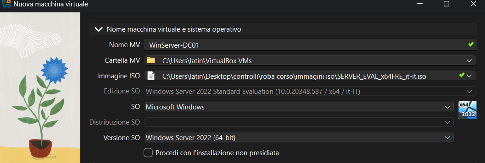
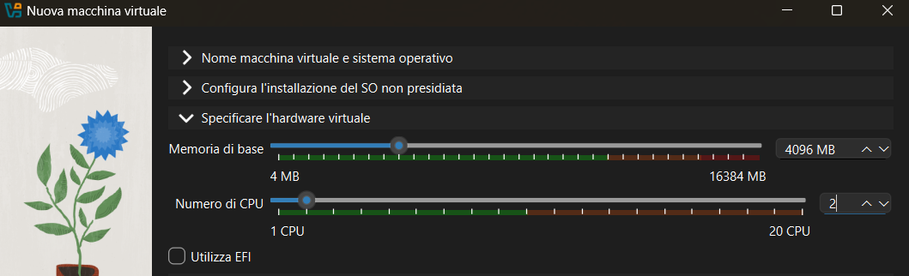
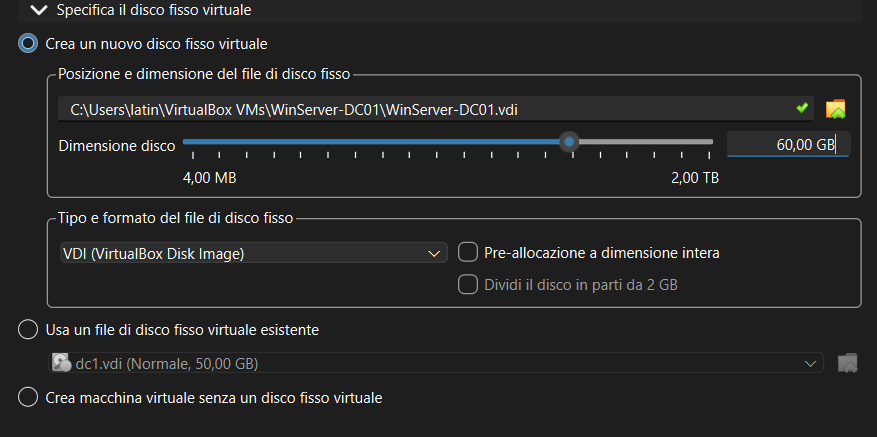

### 2. Installazione sistema operativo
Selezionata la versione Standard Evaluation con 
Esperienza Desktop per disporre dell'interfaccia grafica.
Scelto il tipo di installazione personalizzata per 
eseguire un'installazione pulita.

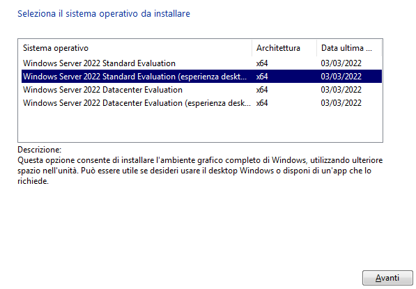
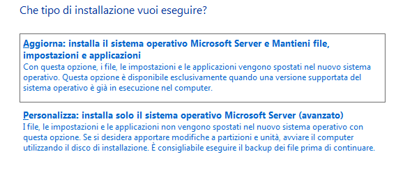

### 3. Installazione Guest Additions
Installate le Guest Additions (AMD64) tramite il menu 
Dispositivi di VirtualBox per migliorare la risoluzione 
e abilitare le funzionalità di integrazione con il sistema host.

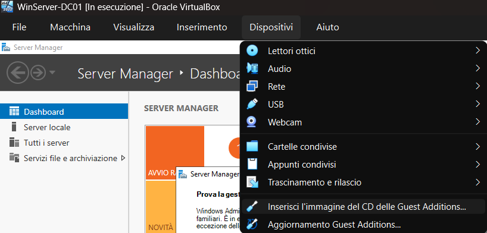
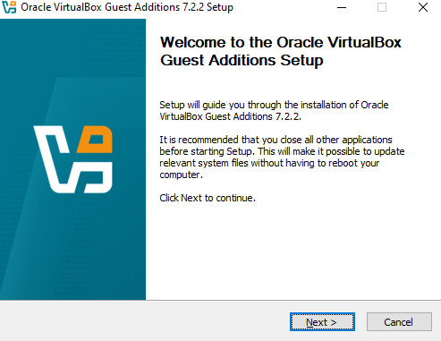
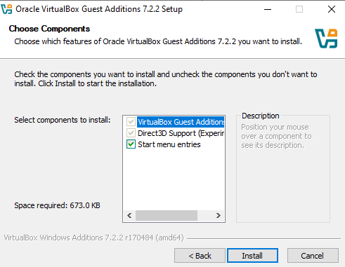

### 4. Primo avvio e Server Manager
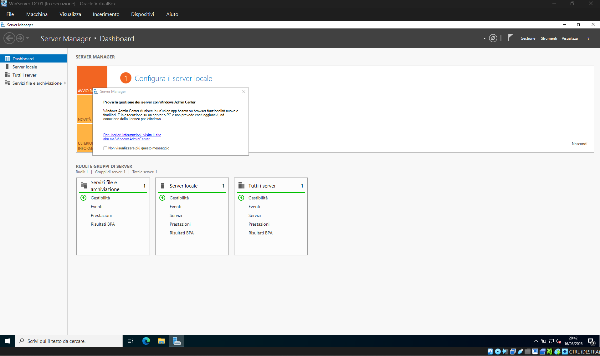

### 5. Configurazione di rete
Impostato IP statico per garantire raggiungibilità 
costante dal futuro client e stabilità del servizio DNS.

| Parametro | Valore |
|-----------|--------|
| IP | 10.0.2.15 |
| Subnet mask | 255.255.255.0 |
| Gateway | 10.0.2.1 |
| DNS primario | 10.0.2.15 |

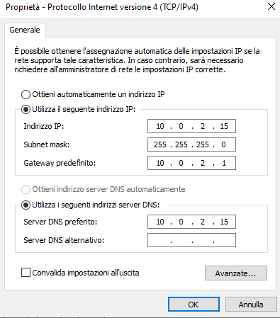
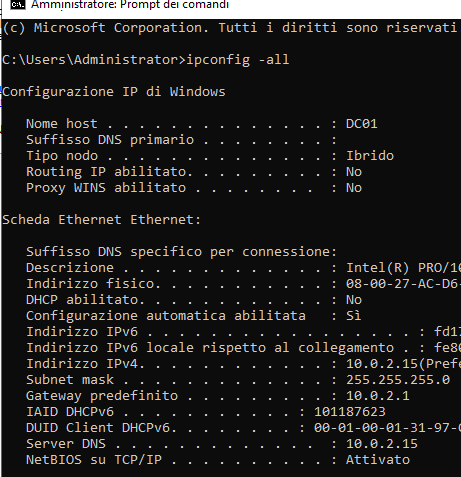

### 6. Rinomina del computer
Rinominato il server in `DC01` prima dell'installazione 
di Active Directory — il nome del DC è permanente e 
non modificabile dopo l'elevazione senza causare problemi.

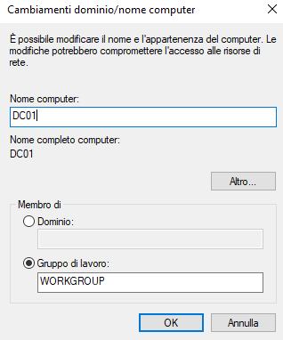

### 7. Snapshot pre-elevazione
Creato snapshot `01-OS-installato-GuestAdditions` prima 
di procedere con l'installazione di AD DS — punto di 
ripristino in caso di errori.

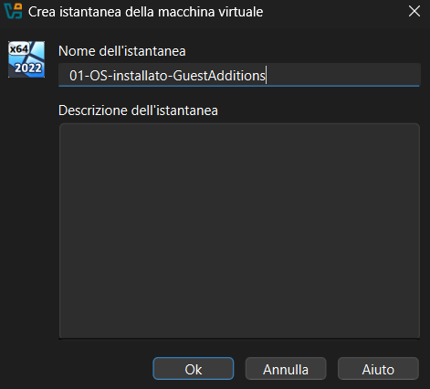
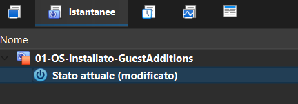

### 8. Installazione ruolo AD DS
Installato il ruolo Servizi di dominio Active Directory 
tramite Server Manager → Aggiungi ruoli e funzionalità.

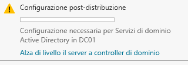

### 9. Elevazione a Domain Controller
Elevato il server a Domain Controller con nuova foresta 
e dominio `lab.local`. Installato contestualmente il 
ruolo DNS, necessario per la risoluzione dei nomi 
all'interno del dominio.

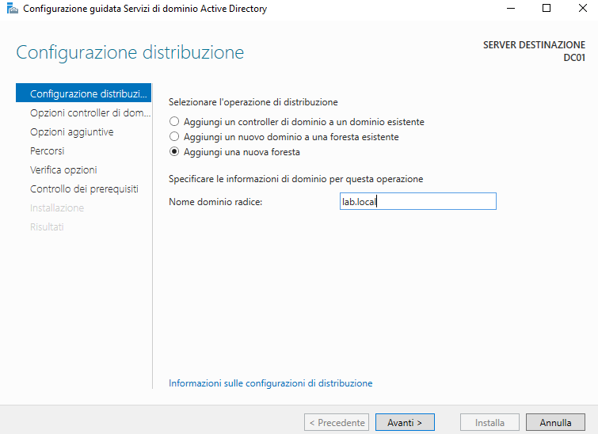
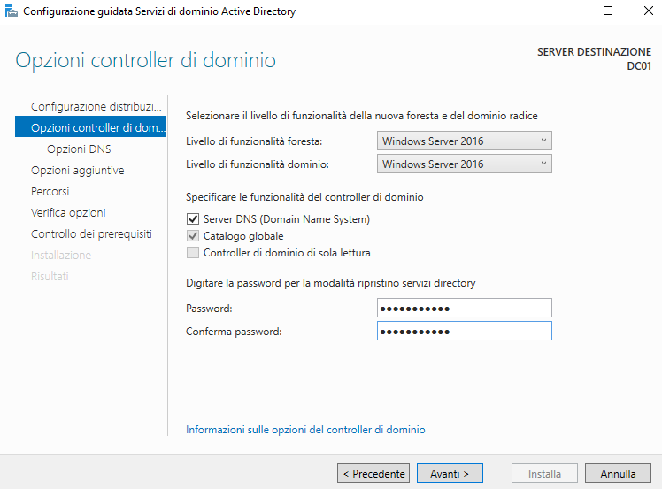
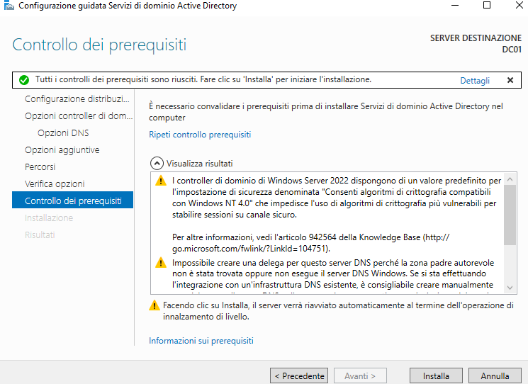

### 10. Verifica post-elevazione
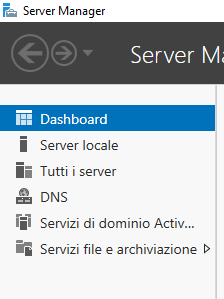
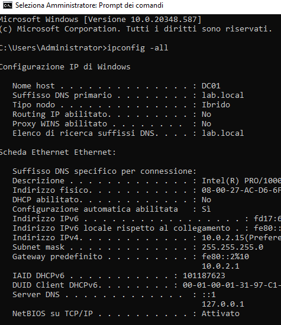

## Risultato
Server operativo come Domain Controller del dominio 
`lab.local` con ruoli AD DS e DNS attivi.

## Snapshot
`02-DC01-AD-DNS-configurato` — stato del sistema 
al termine del modulo.

## Collegamento con Security+
- **AAA** (SY0-701 – 1.2): il DC è il centro di 
  autenticazione del dominio
- **Identity and Access Management** (SY0-701 – 4.6): 
  gestione centralizzata delle identità tramite AD
- **Identity and Access Management** (SY0-701 – 4.6): 
  gestione centralizzata delle identità tramite AD
