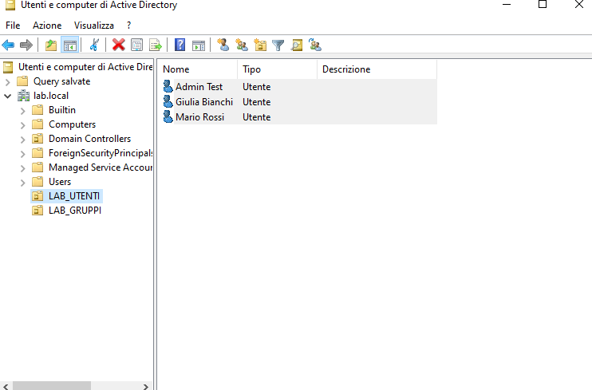
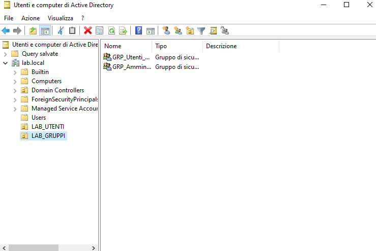
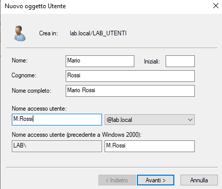
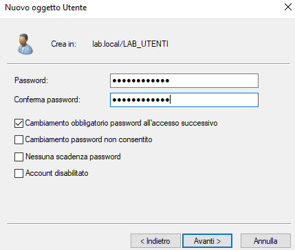
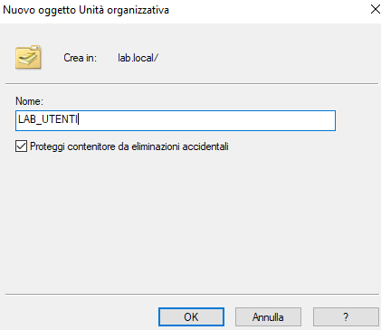
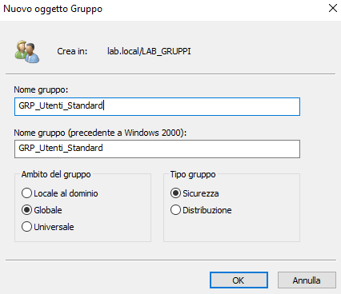
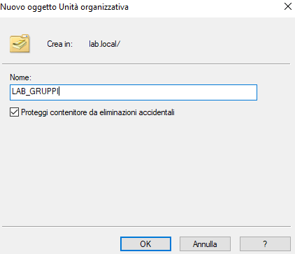
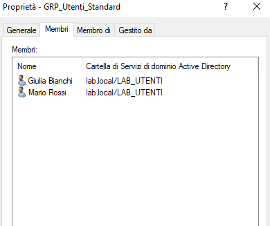
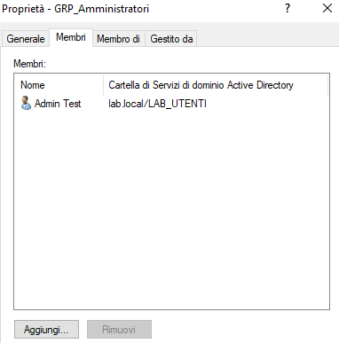

# Modulo 02 - Utenti, Gruppi e Organizational Units

## Obiettivo
Creare e organizzare utenti e gruppi in Active Directory 
tramite Organizational Units, preparando la struttura 
per l'applicazione futura di Group Policy Objects.

## Procedura

### 1. Creazione Organizational Units
Create due OU per separare logicamente utenti e gruppi:
- `LAB_UTENTI` — contiene gli account utente
- `LAB_GRUPPI` — contiene i gruppi di sicurezza

La separazione in OU non è solo organizzativa — le Group 
Policy si applicano a livello di OU, quindi la struttura 
scelta ora determinerà come verranno gestiti i permessi 
nei moduli successivi.

### 2. Creazione utenti
Creati tre utenti nella OU `LAB_UTENTI`:

| Username | Nome | Ruolo previsto |
|----------|------|----------------|
| M.Rossi | Mario Rossi | Utente standard |
| G.Bianchi | Giulia Bianchi | Utente standard |
| Admin.Test | Admin Test | Futuro account privilegiato |

Best practice applicata: **"Cambiamento password 
all'accesso successivo"** su tutti gli account — 
garantisce che solo l'utente conosca la propria password.

### 3. Creazione gruppi
Creati due gruppi di sicurezza nella OU `LAB_GRUPPI`:

| Gruppo | Ambito | Tipo |
|--------|--------|------|
| GRP_Utenti_Standard | Globale | Sicurezza |
| GRP_Amministratori | Globale | Sicurezza |

Scelto il tipo **Sicurezza** invece di Distribuzione 
per poter assegnare permessi alle risorse del dominio 
nei moduli successivi.

### 4. Assegnazione utenti ai gruppi

| Gruppo | Membri |
|--------|--------|
| GRP_Utenti_Standard | Mario Rossi, Giulia Bianchi |
| GRP_Amministratori | Admin Test |

Gli utenti sono separati in gruppi in base al ruolo 
previsto. La distinzione tra utenti standard e account 
amministrativo sarà applicata concretamente nel modulo 
successivo tramite Group Policy Objects (GPO).

## Risultato
Struttura AD organizzata con OU, utenti e gruppi. 
La separazione tra account standard e amministrativo 
è definita a livello di gruppo e sarà rafforzata 
tramite GPO nel modulo successivo.

## Snapshot
`03-Utenti-Gruppi-OU` — stato del sistema 
al termine del modulo.

## Collegamento con Security+
- **AAA** (SY0-701 – 1.2): gestione centralizzata 
  delle identità tramite AD
- **Least Privilege** (SY0-701 –
