# Modulo 03 - Group Policy (GPO)

## Obiettivo
Creare e configurare Group Policy Objects per applicare
controlli di sicurezza centralizzati agli utenti del dominio,
collegando i concetti teorici di Security+ alla pratica
amministrativa di Active Directory.

## Procedura

### 1. Apertura Group Policy Management Console
Accesso tramite Server Manager → Strumenti →
Gestione Criteri di gruppo.

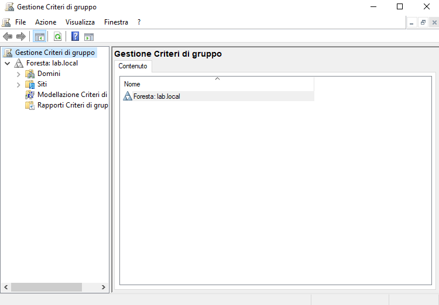

### 2. GPO_PasswordPolicy
Creata GPO collegata a `LAB_UTENTI` per imporre
requisiti minimi di sicurezza sulle password.

| Impostazione | Valore |
|---|---|
| Lunghezza minima password | 12 caratteri |
| Complessità | Abilitata |
| Validità massima | 90 giorni |
| Cronologia password | 10 password memorizzate |

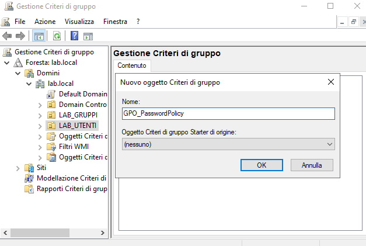
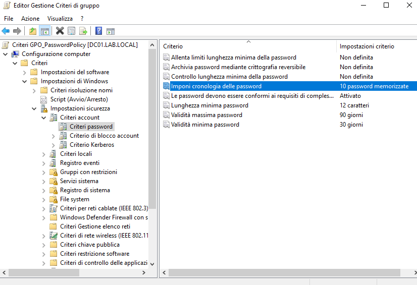

### 3. GPO_BloccaRimovibili
Creata GPO per bloccare l'accesso a tutti i dispositivi
di archiviazione rimovibili — principio di **default deny**:
tutto bloccato tranne ciò che è esplicitamente necessario.

Dispositivi bloccati: CD/DVD, floppy, dischi rimovibili,
unità nastro, dispositivi portatili Windows.
Accessi bloccati per ogni categoria: lettura, scrittura,
esecuzione.

**Security Filtering:** la GPO si applica solo a
`GRP_Utenti_Standard`. Gli amministratori non sono
soggetti al blocco per poter gestire il sistema.

Soluzione tecnica adottata: `Authenticated Users`
mantenuto nel Security Filtering con sola **Lettura**
(necessario per permettere ai computer di leggere la GPO),
mentre **Applica Criteri di gruppo** è assegnato
esclusivamente a `GRP_Utenti_Standard`.

> **Nota:** questa GPO blocca esclusivamente dispositivi
> che si presentano come archiviazione rimovibile.
> Non mitiga attacchi tramite dispositivi HID malevoli
> (es. BadUSB). Per una protezione completa valutare
> USB device whitelisting e restrizioni sugli script.

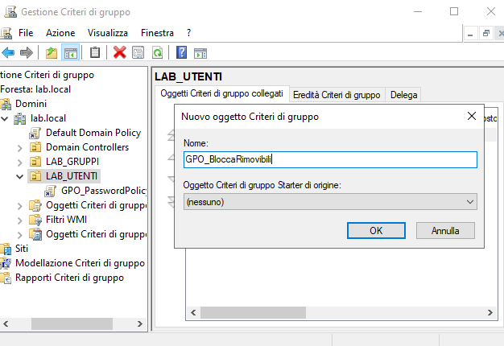
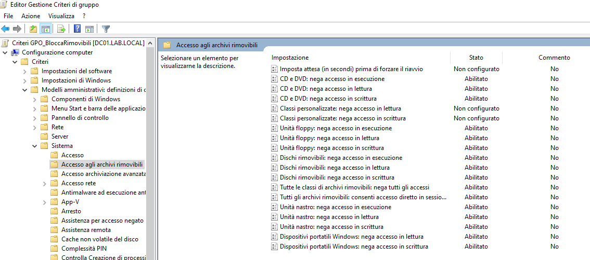
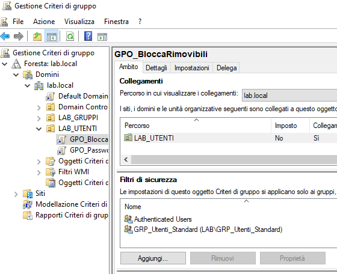
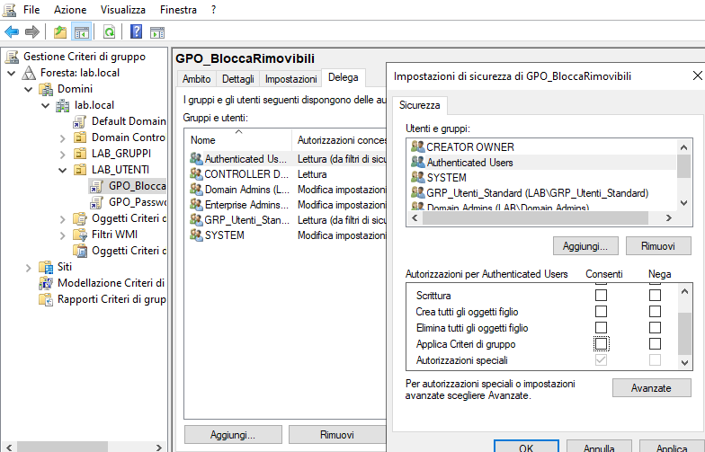
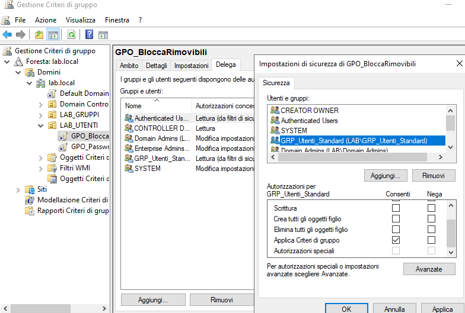

### 4. GPO_BannerLogin
Creata GPO per mostrare un avviso legale prima
del login — informa l'utente che il sistema è monitorato
e che l'accesso è riservato agli utenti autorizzati.
Applicata a tutti gli utenti senza Security Filtering.

| Impostazione | Valore |
|---|---|
| Titolo | AVVISO - Accesso Autorizzato |
| Testo | Sistema monitorato. L'accesso è consentito solo agli utenti autorizzati. Ogni attività è registrata. |

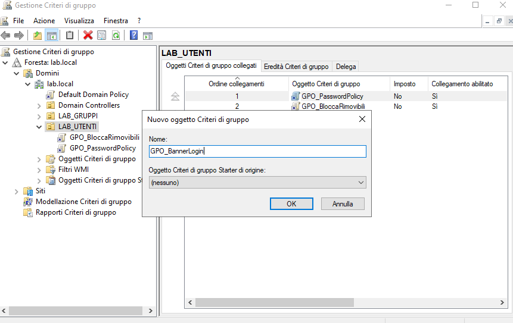
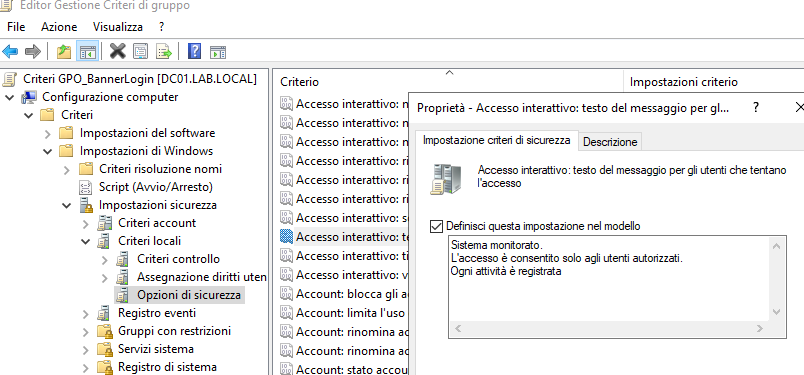
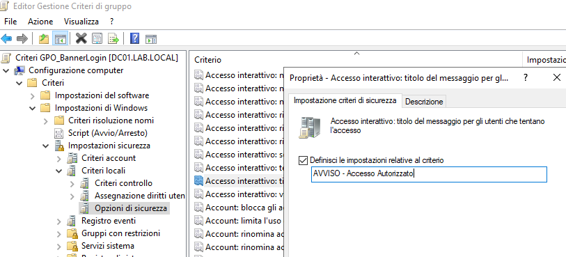

## Risultato
Tre GPO attive collegate a `LAB_UTENTI`:
- `GPO_PasswordPolicy` — ordine 1
- `GPO_BloccaRimovibili` — ordine 2
- `GPO_BannerLogin` — ordine 3

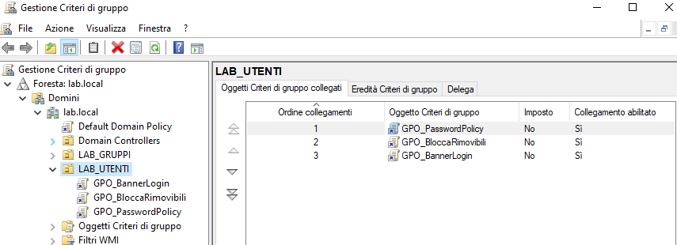

## Snapshot
`04-GroupPolicy` — stato del sistema al termine
del modulo.

## Collegamento con Security+
- **CIA Triad - Confidenzialità** (SY0-701 – 1.2):
  blocco dispositivi rimovibili previene esfiltrazione dati
- **CIA Triad - Integrità** (SY0-701 – 1.2):
  password policy garantisce identità verificabili
- **Least Privilege** (SY0-701 – 2.3):
  Security Filtering applica restrizioni solo agli
  utenti standard, non agli amministratori
- **Data Protection** (SY0-701 – 3.3):
  GPO come controllo tecnico per protezione dei dati
- **Security Controls** (SY0-701 – 1.1):
  GPO come esempio di controllo preventivo automatizzato
