# Modulo 03 - Group Policy (GPO)

## Obiettivo
Creare e configurare Group Policy Objects per applicare
controlli di sicurezza centralizzati agli utenti del dominio,
collegando i concetti teorici di Security+ alla pratica
amministrativa di Active Directory.

## Procedura

### 1. Apertura Group Policy Management Console
Accesso tramite Server Manager → Strumenti →
Gestione Criteri di gruppo.

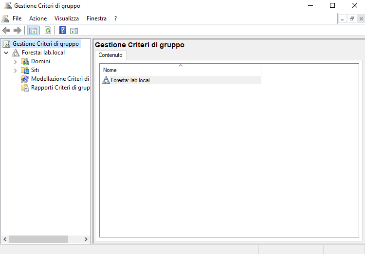

### 2. GPO_PasswordPolicy
Creata GPO collegata a `LAB_UTENTI` per imporre
requisiti minimi di sicurezza sulle password e
limitare i tentativi di accesso.

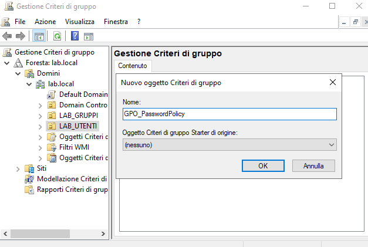

**Criteri password:**

| Impostazione | Valore |
|---|---|
| Lunghezza minima password | 12 caratteri |
| Complessità | Abilitata |
| Validità massima | 90 giorni |
| Cronologia password | 10 password memorizzate |

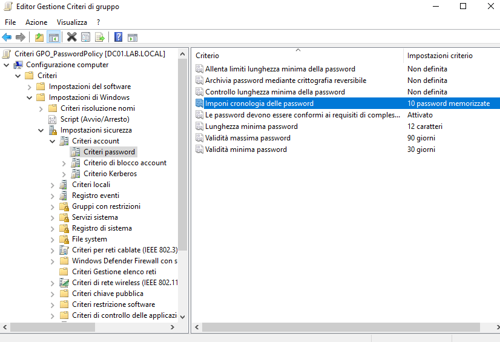

**Criteri di blocco account:**

| Impostazione | Valore |
|---|---|
| Blocca account per | 30 min |
| Reimposta contatore dopo | 30 min |
| Soglia tentativi | 5 tentativi non validi |

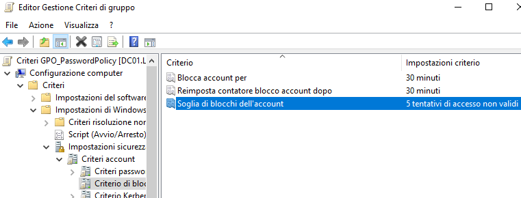

### 3. GPO_BloccaRimovibili
Creata GPO per bloccare l'accesso a tutti i dispositivi
di archiviazione rimovibili — principio di **default deny**:
tutto bloccato tranne ciò che è esplicitamente necessario.

Dispositivi bloccati: CD/DVD, floppy, dischi rimovibili,
unità nastro, dispositivi portatili Windows.
Accessi bloccati per ogni categoria: lettura, scrittura,
esecuzione.

Soluzione tecnica adottata: `Authenticated Users`
mantenuto nel Security Filtering con sola **Lettura**
(necessario per permettere ai computer di leggere la GPO),
mentre **Applica Criteri di gruppo** è assegnato
esclusivamente a `GRP_Utenti_Standard`.

> **Nota:** questa GPO blocca esclusivamente dispositivi
> che si presentano come archiviazione rimovibile.
> Non mitiga attacchi tramite dispositivi HID malevoli
> (es. BadUSB). Per una protezione completa valutare
> USB device whitelisting e restrizioni sugli script.

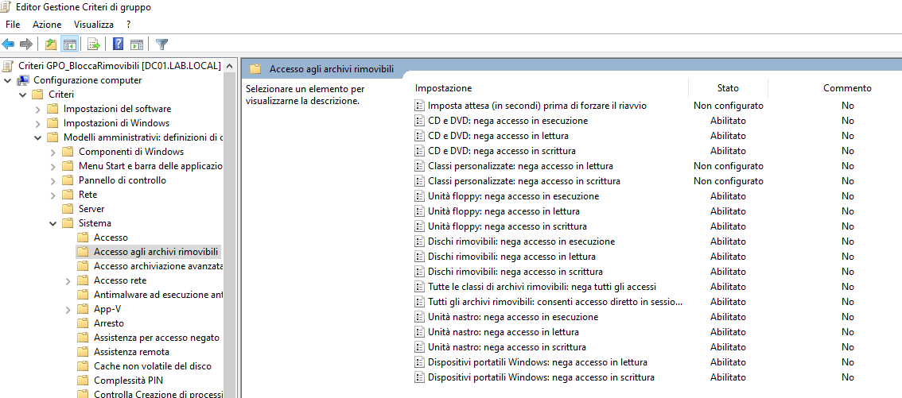
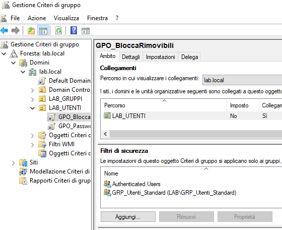

**Security Filtering:** la GPO si applica solo a
`GRP_Utenti_Standard`. Gli amministratori non sono
soggetti al blocco per poter gestire il sistema.

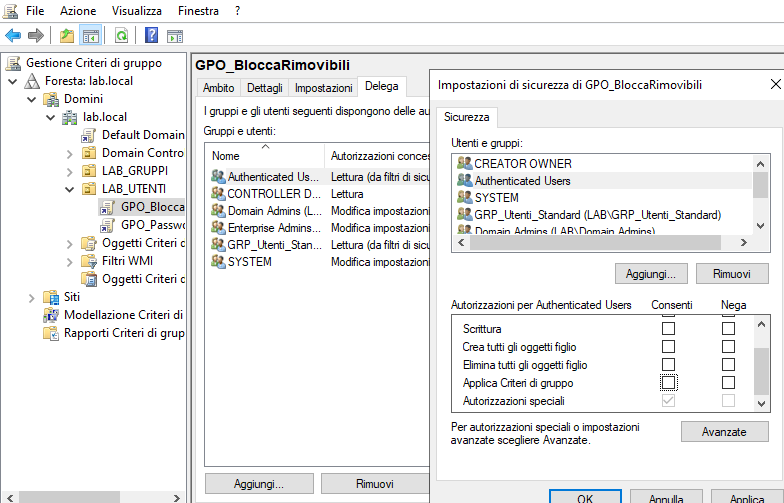
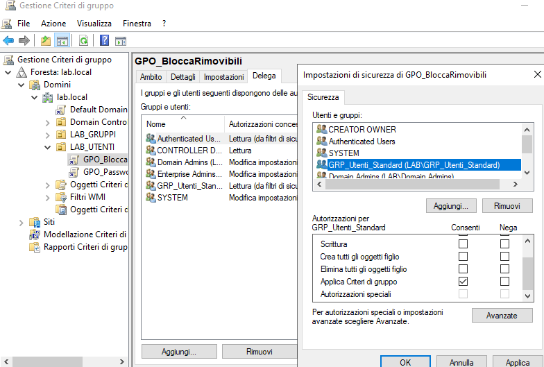

### 4. GPO_BannerLogin
Creata GPO per mostrare un avviso legale prima
del login — informa l'utente che il sistema è monitorato
e che l'accesso è riservato agli utenti autorizzati.
Applicata a tutti gli utenti senza Security Filtering.

| Impostazione | Valore |
|---|---|
| Titolo | AVVISO - Accesso Autorizzato |
| Testo | Sistema monitorato. L'accesso è consentito solo agli utenti autorizzati. Ogni attività è registrata. |

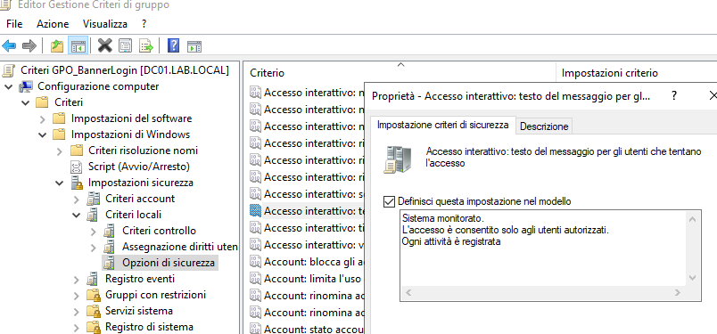
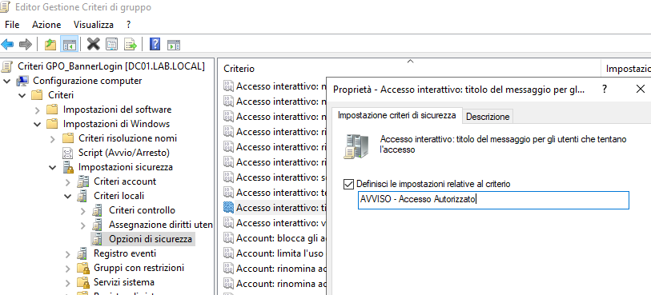

### 5. GPO_RestrizioniUtenti
Creata GPO per limitare gli strumenti di sistema
accessibili agli utenti standard, riducendo la
superficie di attacco in caso di compromissione
di un account.

**Blocco CMD:**

| Impostazione | Valore |
|---|---|
| Impedisci accesso al prompt dei comandi | Abilitato |
| Disabilita elaborazione script batch | Sì |

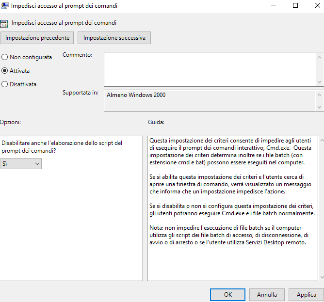

**Rimozione Task Manager:**

| Impostazione | Valore |
|---|---|
| Rimuovi Gestione attività | Abilitato |

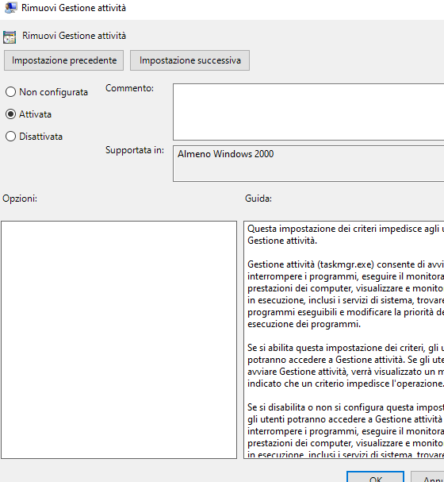

**Restrizioni PowerShell (Modelli amministrativi):**

| Impostazione | Valore |
|---|---|
| Esecuzione script | Solo script firmati |
| Registrazione blocchi di script | Abilitata |

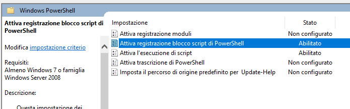

> **Nota:** queste impostazioni regolano solo il
> comportamento degli script eseguiti, non l'apertura
> interattiva della shell. Aggiunte regole AppLocker per
> bloccare l'accesso allo strumento stesso.

**Blocco effettivo di PowerShell — AppLocker:**

Configurate regole AppLocker sotto `Configurazione computer
→ Criteri → Impostazioni di Windows → Impostazioni protezione
→ Criteri di controllo dell'applicazione → AppLocker`.

Generate le regole predefinite (Allow) su Program Files,
Windows e Administrators, prerequisito per non bloccare
l'intero sistema una volta attivato AppLocker:

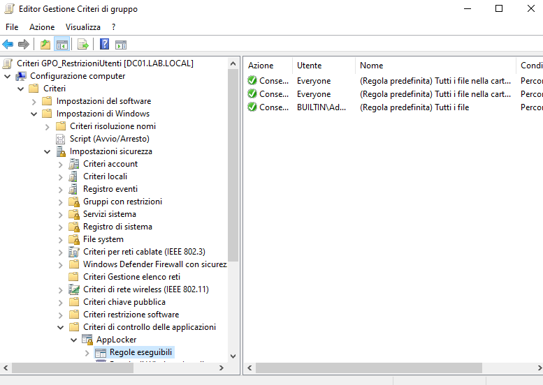

Create due regole di blocco (Deny) per `GRP_Utenti_Standard`,
basate su condizione **Percorso**:

| Eseguibile bloccato | Percorso |
|---|---|
| powershell.exe | `C:\Windows\System32\WindowsPowerShell\v1.0\powershell.exe` |
| powershell_ise.exe | `C:\Windows\System32\WindowsPowerShell\v1.0\powershell_ise.exe` |

> **Nota:** bloccato anche `powershell_ise.exe` (ISE, editor
> grafico di script) insieme alla shell principale, altrimenti
> resta comunque un modo per eseguire comandi interattivamente.

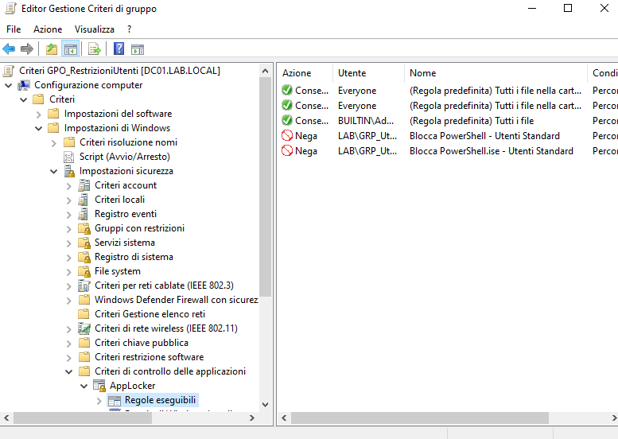

Configurato inoltre l'avvio automatico del servizio
**Identità applicazione** (Application Identity) tramite
GPO Preferences (`Configurazione computer → Preferenze →
Impostazioni Panel di controllo → Servizi`) — condizione
necessaria affinché AppLocker applichi effettivamente
le regole sulla macchina target.

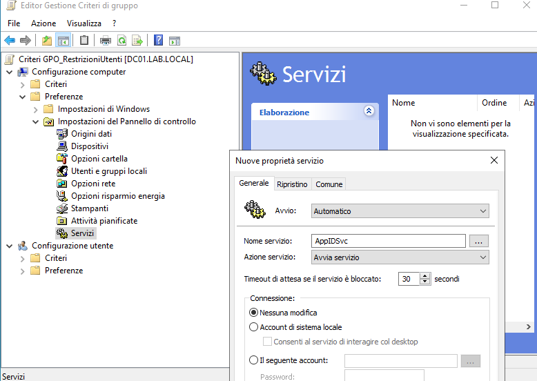

**Security Filtering:** applicata solo a
`GRP_Utenti_Standard`.

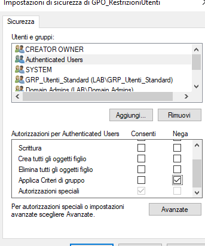
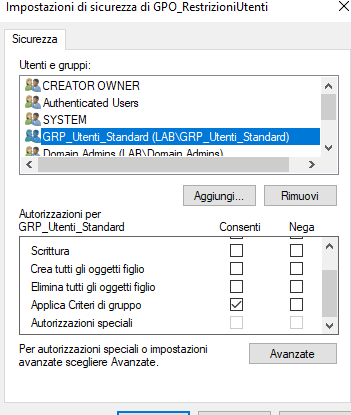

## Risultato
Quattro GPO attive collegate a `LAB_UTENTI`:
- `GPO_PasswordPolicy` — ordine 1
- `GPO_BloccaRimovibili` — ordine 2
- `GPO_BannerLogin` — ordine 3
- `GPO_RestrizioniUtenti` — ordine 4

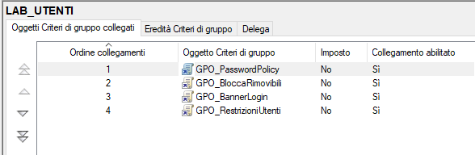

## Snapshot
`04-GroupPolicy` — stato del sistema al termine
del modulo.

## Collegamento con Security+
- **CIA Triad - Confidenzialità** (SY0-701 – 1.2):
  blocco dispositivi rimovibili previene esfiltrazione dati
- **CIA Triad - Integrità** (SY0-701 – 1.2):
  password policy garantisce identità verificabili
- **Least Privilege** (SY0-701 – 2.3):
  Security Filtering applica restrizioni solo agli
  utenti standard, non agli amministratori
- **Data Protection** (SY0-701 – 3.3):
  GPO come controllo tecnico per protezione dei dati
- **Security Controls** (SY0-701 – 1.1):
  GPO come esempio di controllo preventivo automatizzato
- **Hardening** (SY0-701 – 4.1):
  AppLocker come application allowlisting/denylisting,
  riduzione della superficie di attacco tramite restrizione
  degli strumenti eseguibili disponibili all'utente
