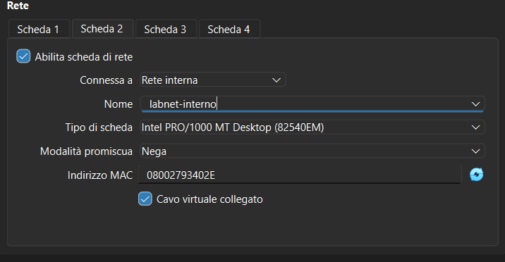
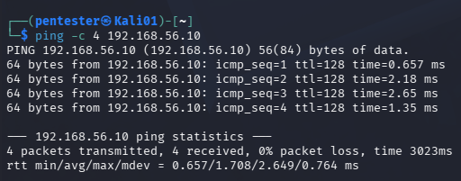

# Modulo 04 - Kali Linux — Setup, configurazione e test di sicurezza progressivi
## Obiettivo
Introdurre nel laboratorio una macchina Kali Linux con il ruolo di
attaccante esterno, da utilizzare nei moduli successivi per testare
la robustezza dell'infrastruttura via via costruita.
## Procedura
### 1. Creazione VM in VirtualBox
Creata VM con nome `Kali-PT01`.
| Parametro | Valore |
|---|---|
| RAM | 4 GB |
| CPU | 2 core |
| Disco | 40 GB dinamico |
### 2. Verifica integrità immagine
Prima dell'installazione, calcolato l'hash SHA256 dell'immagine ISO
scaricata e confrontato con quello pubblicato ufficialmente da Kali —
verifica di integrità della fonte prima di utilizzare qualsiasi
immagine di sistema, specialmente su una macchina dedicata a test
di sicurezza.
### 3. Installazione
Installazione completata mantenendo la macchina in **WORKGROUP**,
senza join al dominio `lab.local` per simulare un attaccante esterno.
### 4. Configurazione di rete
Configurate due schede di rete con scopi distinti:
| Scheda | Modalità | Scopo |
|---|---|---|
| Scheda 1 | NAT semplice | Accesso a Internet per aggiornamento pacchetti |
| Scheda 2 | Rete interna (`labnet-interno`) | Comunicazione diretta con il Domain Controller |

Il Domain Controller si trova anch'esso su NAT semplice: ogni VM su
NAT semplice vive isolata in una propria "bolla" di rete, quindi due
VM su NAT semplice non si vedono tra loro anche con IP nella stessa
subnet. Per questo è stata aggiunta una seconda scheda su una Rete
interna dedicata, con IP statici assegnati manualmente:
| Macchina | IP |
|---|---|
| WinServer-DC01 | 192.168.56.10 |
| Kali-PT01 | 192.168.56.20 |
> **Nota:** scartata la modalità Host-only Network, che crea un
> adattatore visibile anche sull'host fisico reale, ampliando la
> superficie di attacco in modo bidirezionale — se una VM di test
> venisse compromessa, avrebbe un percorso diretto verso la macchina
> fisica. La Rete interna resta isolata solo tra le VM coinvolte.
> La stessa scelta verrà riutilizzata per Metasploitable (modulo 16).
### 5. Verifica di connettività
Testata la comunicazione tra le due macchine sulla rete interna
tramite ping in entrambe le direzioni.

Il test conferma che Kali-PT01 comunica correttamente con il Domain
Controller sulla rete `labnet-interno`, isolata dal traffico NAT.
## Risultato
Kali-PT01 operativa, aggiornata, e in comunicazione con il Domain
Controller sulla rete interna dedicata. Pronta per i test di
sicurezza progressivi dei moduli successivi.
## Snapshot
`01-KaliPT01-rete-configurata` — stato del sistema al termine
del modulo.
## Collegamento con Security+
- **Network Segmentation** (SY0-701 – 3.2): separazione tra rete
  NAT (accesso esterno) e rete interna isolata (comunicazione con
  il target), a riduzione della superficie di attacco
- **Data Integrity** (SY0-701 – 1.2): verifica dell'hash
  dell'immagine ISO prima dell'uso, per garantire l'autenticità
  della fonte
